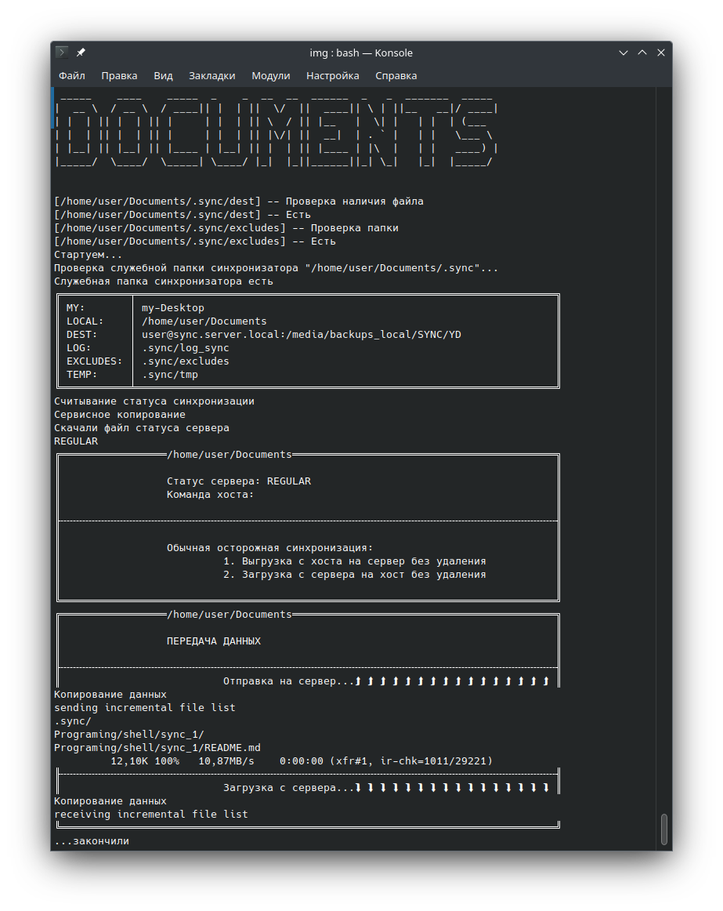

# Скрипт для персональной синхронизации.
Испольтзует rsync через ssh.

Не для совместной работы. 
> Проблема совместной работы заключается в том, 
> что синхронизация происходит по даже изменения файлов. 
> Если над одним файлом работали в двух местах то сохранится только тот, который изменяли позже.

## Суть работы

Если всё упростить, то программа rsync может копировать файлы двумя способами:
1. Копировать файлы с первой папки во вторую и при совпадении имён файлов старый фал переписывается новым. При таком способе удаление файлов не происходит, а только добавляются новые файлы.
2. Копировать файлы с первой папки во вторую с удалением расхождений. Все файлы исходной папки считаются правильными и все расхождения в папке назначения удаляются, не взирая на метки времени.  

Если на двух папках использовать программу rsync в обе стороны для копирования без удаления (вариант 1.) в обе стороны, то файлы в этих папках будут всегда одинаковые.\
**Так происходит синхронизация.**

Для удаления файлов используется режим копирования с удалением расхождений (вариант 2.).\
**Так происходит управление файлами, удаление "лишних".**

Собственно на этих двух режимах копирования rsync и построен синхронизатор.

    Программа представляет собой один shell скрипт, использующий rsync работающий поверх ssh.

Где-то на удаленном всегда включённом компьютере, NASе с поддержкой ssh, или на корпоративном сервере, есть место, к которому есть доступ по ssh-протоколу с установленными ключами, чтобы доступ был без пароля. 

    ![Важно]
    Доступ к серверу должен быть именно по ключам, 
    чтобы подключение происходило без запроса пароля, 
    поскольку за одну синхронизацию происходит несколько запросов

На одном Вашем компьютере есть папка на диске, которая просто синхронизируется с помощью RSYNC с папкой на сервере.
На другом Вашем компьютере есть такая-же папка для которой запускается rsync для её синхронизации с папкой на сервере.
Команда синхронизации запускается в ручную или устанавливается в crontab и происходит автоматически по указанному в crontab расписанию.
При этом получается что все папки всегда полностью одинаковы.

По сути работы -- это всё.


## Скриншоты




## Далее детали.

При такой конфигурации системы не возможно удалить файл, поскольку при следующей итерации синхронизации он восстановится с сервера.
Для этого на компе где я хочу удалить файл (перенести в другую папку), я должен запустить rsync с параметрами, чтобы все разночтения были удалены с сервера.

На самом сервера ставится метка для клиентских компов о том, что им нужно считать синхронизацию так, чтобы считать всё с сервера и удалить различия у себя.

Эта процедура происходит один раз, за тем происходит обычная синхронизация папок.

Что-бы устанавливать статус синхронизации для клиентов, на сервер пришлось ввести список "клиентов" с установлением для них статуса.
т.е. если к папке синхронизации подключено несколько компов, то при отправке на сервер команды на удаление файлов для всех клиентов 
устанавливается статус взять с сервера и удалить у себя, после чего для этого клиента устанавливается статус регулярных синхронизаций.
При этом, если какой-то клиент подключится через неделю, то он всё равно получит команду обновить свои данные так, чтобы взять всё с сервера и различия у себя удалить.


## Назначение скриптов

### [sync_1.sh] 

-- Собственно это и есть скрипт синхронизации. 
Для работы достаточно его одного. 
Все действия по синхронизации делает именно этот скрипт, 
все другие -- просто вспомогательные.

### [sync_1_aliases.sh]

-- это скрипт содержит записи alias для удобства использования основного скрипта\
и строку для автодополнений. \
Всё это для включения в конфиг-файл консоли (.bashrc).

Он включается скриптом инсталлятором (sync_install.sh) или в ручную в .bashrc как include \
обычно так: ". /path/sync_1_aliases.sh"
Алиасы заменяю длинное название скрипта [sync_1.sh] на короткое [s1] \
или можете их переписать на свой вкус. 

### [sync_all.sh] и [sync_all.list] 

-- Скрипт для синхронизации нескольких папок.
У него есть конфиг-файл **sync_all.list** в котором просто перечислены 
папки для синхронизации и текстовое сообщение-баннер для оформления лога синхронизации (не обязательно)
Пример файла **sync_all.list** есть в дистрибутиве.

### [sync_install.sh]

-- Установочный скрипт.

1. Копирует скрипты **sync_1.sh**, **sync_1_aliases.sh** и **sync_all.sh** в папку **$HOME/bin**
2. Проверяет наличие там фала настроек **sync_all.list**. Если его нет, то копирует.   
3. Копирует иконки в папку иконок **$HOME/bin/icons**
4. Копирует .desktop-файлы в папку для десктоп-файлов **$HOME/bin**
5. Внутри .desktop-файлов исправляет пути к иконкам, исполняемым скриптам и текущий путь
6. Проверяет наличие include вставки **sync_1_aliases.sh** в .bashrc файле. Если её там нет, то вписывает.


## Как работают режимы синхронизации:

### [UP]

-- Отправить файлы с локального компьютера на сервер **без удаления**

### [DL]

-- Считать файлы с сервера на локальный компьютер **без удаления**

### [REGULAR]

-- два прохода:

1. [UP] - отправляются данные с локального компа на сервер **без удаления**,
2. [DL] - считываются файлы с сервера на локальный компьютер **без удаления**

> **[ РИСК ]**:\
> если на компьютерах одновременно работают с одними и тем-же файлами, \
> то сохранятся только файлы, дата изменения которых будет более новая, \
> "старые" перезапишутся "новыми".\
> За этим нужно следить самостоятельно.

### [UP_INIT]

-- Отправляются файлы с локального компьютера на сервер <ins>**с удалением расхождений на сервере**</ins>.\
После выполнения отправки файлов на сервер, для всех клиентов устанавливается статус **[DL_INIT]**,\
кроме локального, с которого была выполнена команда, для него устанавливается статус **[REGULAR]**.
            
### [DL_INIT]

-- Считываются данные с сервера на локальный компьютер \
<ins>**с удалением расхождений на локальном компьютере**</ins>.\
Если эта команда выполняется по требованию сервера, \
т.е. была установлена на сервере с другого компьютера, а не запущена в ручную, \
то на сервере для этого клиента устанавливается статус [REGULAR]

            
### [PAUSE]

-- Устанавливает статус сервера на "**паузу**". \
В этом режиме синхронизация не происходит.

Это нужно для того, чтобы на самом сервере подправить файлы 
без вмешательства со стороны клиентов, и чтобы во времЯ работы с фалами синхронизация не происходила
            
### [UP_EDIT]

-- Когда на сервере стоит статус **[PAUSE]**, 
то эта команда работает как **[UP_INIT]** 
для изменения файлов на сервере при отключённой синхронизации
            
### [UNPAUSE]

-- снимает сервер с **"паузы"** и устанавливает ля всех клиентов статус **[DL_INIT]**,
чтобы все клиенты получили все изменения, внесённые на сервер.

### [CLOUD_UP_INIT]

Запускать так:

    sync_1.sh CLOUD_UP_INIT <локальная_папка> <удалённая_папка>

Создаёт sync-репозиторий из указанной папки.\
<локальная_папка> -- полный или относительный путь к папке, или "."\
<удалённая_папка> -- папка на сервере, которая будет облачным хранилищем\
Обычно вида "user@host/путь/папка" (без "/" в конце)

    Действия:

    1. Создаёт в <локальной_папке> папку .sync
       Создаёт файл .sync/excludes (Файл исключений для rsync)
       Создаёт файл .sync/dest внутрь которого записывает облачный адрес
       Создаёт файл .sync/MY_NAME внутрь которого записывает статус [REGULAR]
    2. Копируем <локальную_папку>/.sync на сервер в папку <удалённая_папка>/.sync
    3. Выполняет обычную синхронизацию [REGULAR] для записи данных на сервер.


## Техническая реализация

В папке на компьютере которую нужно синхронизировать нужно создать папку [.sync]
Внутри неё должны быть следующие файлы:

-    **[dest]** -- внутри путь к папке на сервере вида **[user@server:/path/to/folder/sync_folder]**
-    **[excludes]** -- файл со списком исключений для **rsync** (может быть пустым)

Там-же скриптом будут созданы лог-файл [log_sync], временная папка для работы синхронизатора, 
и файл имени этого устройства вида [USER_<hostname>] внутри со статусом этого устройства, считанным с сервера.


## Костыль, который пока не удалось обойти

(хотя, если честно, я им не занимался, поскольку скрипт писал для себя, а мне это не мешало)

Дело в том, что для использования в качестве транспорта ssh нужно указывать порт, 
через который происходит подключение.  Это делается странной командой, 
которую нельзя включить в URL-строку удаленного подключения. 
Её приходится указывать прямо в команде синхронизации.

Вот эта строка: ```--rsh='ssh -p <порт>'```

Так что, если у Вас другой порт, а он у вас другой, 
то Вам придётся это вписать прямо в скрипт в двух местах: 
в функциях **dl()** и **dl_init()**.

В дальнейшем исправлю.


## Автоматическая синхронизация

Чтобы происходила автоматическая синхронизация, Вам нужно вписать команду синхронизации в crontab.

Выполните:\
```crontab -e```

и добавьте строку:\
```1  *  *  *  *             /home/user/bin/sync_all.sh```

В этом случае синхронизация будет происходить на первой минуте каждого часа.

